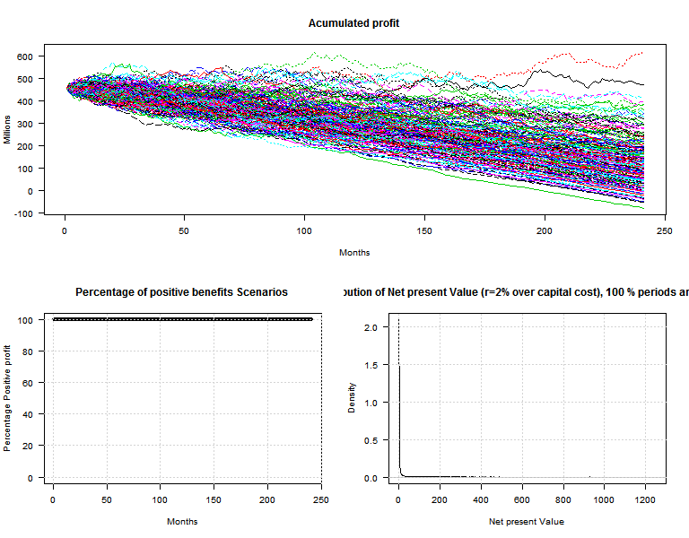

Windmill profit simulation
========================================================
author: Pedro Diaz Simal
date: 25 July 2014

The problem
========================================================

Windmill farms are affected by several sources of uncertainty

- Environmental uncertainty
- Technological uncertainty 
- Consumption uncertainty
- Institutional uncertainty (tariffs)
- Financial Uncertainty
- 

the purpose of the app is to model uncertainty results

the project is undergoing, this is just an attempt

Environmental & Consumption uncertainty
========================================================

The profit of the firms is related with:

- Energy consumption of the society measured in instant demand
- Available energy production capacity
- Resource availability in time
- Price volatility in energy markets

Those problems are modelled with
- Expected profit rate
- Volatility of expected profit rate

Institutional uncertainty 
========================================================

The profit of the firms is related with:

- Effective tariffs fixed to protect consumers from price volatility
- Public subsides to renewable production

Those problems are modelled with
- Real Tariffs reduction
- Real Tariffs volatility

Financial uncertainty 
========================================================

The profit of the firms is related with:

- Financial cost volatility
- Uncertainty on new sources availability

Those problems are modelled with
- Monthly financial payments
- monthly financial levies volatility

Tecnological  uncertainty 
========================================================

The profit of the firms is related with:

- Effective investment cost

Those problems are modelled with
- Total investment cost
- Total life of the project

note that financial fees have to be determined as:

\[month\_fin\_cost=\frac{Tot\_Invest}{12\,n\_years}\]

hence the analysis shows the gross profit of the project and interest rates have to be computed as expenses still to be paid

Global uncertainty 
========================================================

The net profit of the firm is then obtained for a number of cases from 1 to 2000:

Results 
========================================================

The net profit of the firm is then observed:
- Temporal evolution for the determined scenario and the fixed trajectories
- Monthly evolution of Proportion of positive  cases
- Distribution of NPV cases for a  2% net rate of discount

Results 2
========================================================

The final gross profit of the firm is then observed as a random variable:

Example: a random profit rate may produce a net present value with different randomness.

 
